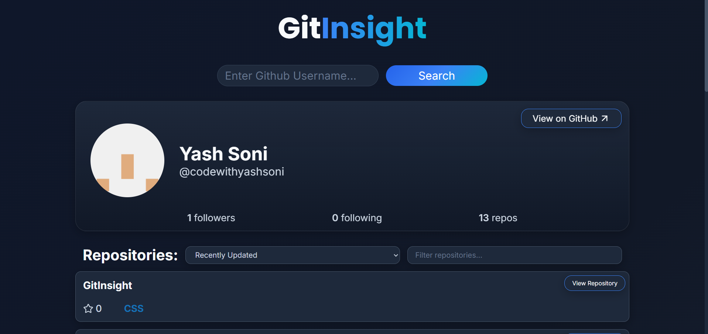
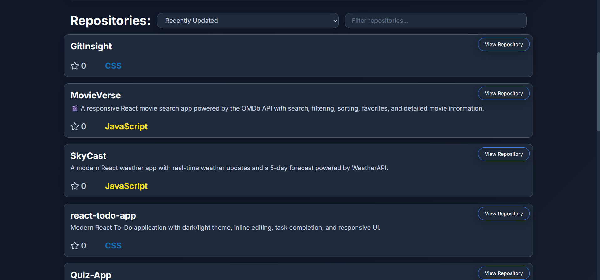

# GitInsight 🔍

A modern and responsive GitHub Profile Finder built with React that lets you instantly search for any GitHub user, explore their profile, and browse their public repositories with filtering and sorting capabilities.

---

## 🌐 Live Demo

**🔗 Live Website:** 

---

## 📸 Preview

### Home Screen


---

### User Profile



---

### Repository List



---

## ✨ Features

* 🔍 Search any public GitHub profile
* 👤 View profile information
* 🖼️ User avatar
* 📝 Bio
* 👥 Followers & Following
* 📦 Public repository count
* ⭐ Repository stars
* 💻 Repository language with language colors
* 🔎 Filter repositories by name
* 📈 Sort repositories by:

  * Recently Updated
  * Most Stars
* 🔗 Open GitHub profile directly
* 📂 Open individual repositories
* ⏳ Loading spinner while fetching data
* ❌ Friendly error handling
* 📱 Fully responsive design
* 🎨 Modern glassmorphism-inspired UI

---

## 🛠️ Built With

* React
* JavaScript (ES6+)
* Vite
* CSS3
* GitHub REST API
* Lucide React Icons

---

## 📁 Project Structure

```text
src
│
├── components
│   ├── ErrorMessage.jsx
│   ├── Loader.jsx
│   ├── Logo.jsx
│   ├── ProfileCard.jsx
│   ├── RepositoryCard.jsx
│   ├── RepositoryControls.jsx
│   ├── RepositoryList.jsx
│   ├── RepositorySection.jsx
│   ├── SearchBar.jsx
│   └── UserData.jsx
│
├── App.jsx
├── main.jsx
└── index.css
```

---

## 🚀 Getting Started

Clone the repository:

```bash
git clone https://github.com/codewithyashsoni/GitInsight.git
```

Move into the project folder:

```bash
cd GitInsight
```

Install dependencies:

```bash
npm install
```

Start the development server:

```bash
npm run dev
```

---

## 📡 GitHub API Endpoints Used

Profile

```text
https://api.github.com/users/{username}
```

Repositories

```text
https://api.github.com/users/{username}/repos
```

---

## 📖 What I Learned

While building **GitInsight**, I practiced and strengthened my understanding of:

* React Components
* React Hooks (`useState`, `useEffect`)
* Component Composition
* Conditional Rendering
* Props
* Async / Await
* Promise.all()
* Fetch API
* Error Handling
* Array Filtering
* Array Sorting
* Responsive Design
* CSS Variables
* Modern UI Design
* API Integration

---

## 💡 Future Improvements

* Repository pagination
* More sorting options
* Search history
* Repository topics
* Dark / Light theme
* Repository statistics charts
* GitHub contribution graph
* Favorite GitHub profiles

---

## 👨‍💻 Author

**Yash Soni**

GitHub: https://github.com/codewithyashsoni
